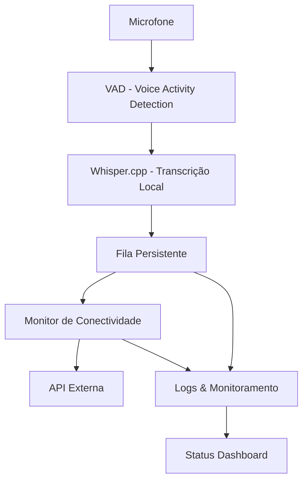

# 🎙️ Real-Time Audio Transcription System

[](https://opensource.org/licenses/MIT)
[](https://nodejs.org/)
[](https://python.org/)
[](https://www.raspberrypi.org/)

Sistema completo de transcrição de áudio em tempo real usando Whisper local com VAD (Voice Activity Detection), otimizado para execução em Raspberry Pi e outras plataformas Linux.

## 🌟 Características Principais

- **🎯 Detecção Inteligente de Voz**: VAD automático para iniciar transcrição apenas quando há fala
- **🔒 Processamento Local**: Whisper.cpp executado offline, sem dependência de internet
- **📦 Fila Persistente**: Sistema robusto de filas com retry automático e recuperação de falhas
- **🌐 Conectividade Adaptável**: Monitora conexão e envia dados quando online
- **🔄 Duas Implementações**: Versões completas em Node.js e Python com APIs equivalentes
- **🐳 Containerização**: Suporte Docker com docker-compose
- **⚙️ Execução como Serviço**: Configuração systemd e PM2 para execução contínua
- **📊 Monitoramento**: Logs detalhados e comandos de status em tempo real

## 🏗️ Arquitetura do Sistema



## 📁 Estrutura do Projeto

```
newproject/
├── 📄 README.md                    # Este arquivo
├── 📄 CLAUDE.md                    # Documentação técnica completa
├── 📂 nodejs-whisper-transcriber/  # Implementação Node.js
│   ├── 🎯 index.js                 # Aplicação principal
│   ├── 📦 package.json             # Dependências e scripts
│   ├── 🐳 Dockerfile               # Container Node.js
│   ├── 🐳 docker-compose.yml       # Orquestração Docker
│   ├── ⚙️ ecosystem.config.js      # Configuração PM2
│   ├── 🔧 whisper-transcriber.service # Serviço systemd
│   ├── 📂 src/                     # Código fonte
│   │   ├── vad.js                  # Detecção de voz
│   │   ├── transcribe.js           # Interface Whisper
│   │   ├── queue.js                # Gerenciamento de fila
│   │   └── sender.js               # Cliente HTTP
│   └── 📂 scripts/                 # Scripts de instalação
│       ├── install-whisper.sh      # Setup automático Whisper
│       └── test-system.sh          # Testes do sistema
│
├── 📂 python-whisper-transcriber/  # Implementação Python
│   ├── 🎯 main.py                  # Aplicação principal
│   ├── 📦 requirements.txt         # Dependências Python
│   ├── 📂 src/                     # Código fonte
│   │   ├── vad.py                  # VAD com webrtcvad
│   │   ├── transcribe.py           # Múltiplos backends Whisper
│   │   ├── queue.py                # Fila SQLite
│   │   └── sender.py               # Cliente HTTP async
│   └── 📂 scripts/                 # Scripts de setup
│       ├── install.sh              # Instalação geral
│       ├── setup-pi.sh             # Configuração Raspberry Pi
│       └── test-system.py          # Suite de testes
│
├── 📂 examples/                    # Exemplos e mocks
│   ├── mock-api-server.js          # Servidor de teste Node.js
│   ├── mock-api-server.py          # Servidor de teste Python
│   └── api-examples.sh             # Exemplos de uso da API
│
└── 📂 scripts/                     # Scripts gerais
    └── run-tests.sh                # Testes integrados
```

## 🚀 Quick Start

### Node.js (Recomendado para iniciantes)

```bash
# 1. Clone e configure
git clone <repository-url>
cd newproject/nodejs-whisper-transcriber

# 2. Instalação automática (instala Whisper.cpp + dependências)
npm run setup

# 3. Configure variáveis de ambiente
cp .env.example .env
nano .env  # Edite API_URL e API_TOKEN

# 4. Teste a instalação
npm run test

# 5. Execute
npm start
```

### Python (Para usuários avançados)

```bash
# 1. Configurar ambiente virtual
cd python-whisper-transcriber
python -m venv venv
source venv/bin/activate  # Linux/Mac

# 2. Instalar dependências
pip install -r requirements.txt

# 3. Configurar
cp .env.example .env
nano .env

# 4. Testar sistema
python main.py test

# 5. Executar
python main.py start
```

## ⚙️ Configuração

### Variáveis de Ambiente (.env)

```bash
# API de destino (obrigatório)
API_URL=https://sua-api.com/transcripts
API_TOKEN=seu_token_secreto_aqui

# Configurações do Whisper
MODEL_PATH=./models/ggml-base.en.bin
WHISPER_PATH=./whisper.cpp/main  # Node.js apenas
LANG=en
N_THREADS=2  # Ajuste conforme CPU

# Configurações de VAD
SILENCE_THRESHOLD=1000
MIN_RECORDING_TIME=500
VAD_AGGRESSIVENESS=2  # 0-3, maior = mais sensível

# Rede e conectividade
CONNECTIVITY_CHECK_INTERVAL=5000
MAX_RETRIES=5
RETRY_BACKOFF_MS=1000

# Logs (opcional)
LOG_LEVEL=info
LOG_FILE=./logs/transcriber.log
```

### Modelos Recomendados por Hardware

| Hardware | RAM | Modelo Recomendado | Tamanho | Velocidade |
|----------|-----|-------------------|---------|------------|
| Pi Zero/1GB | 1GB | `ggml-tiny.en-q8_0.bin` | ~40MB | Rápido |
| Pi 4/2GB | 2GB | `ggml-base.en-q5_0.bin` | ~60MB | Médio |
| Pi 4/4GB+ | 4GB+ | `ggml-small.en-q5_0.bin` | ~180MB | Lento |
| Desktop | 8GB+ | `ggml-medium.en-q5_0.bin` | ~800MB | Muito lento |

## 🔧 Comandos CLI

### Node.js

```bash
# Status e monitoramento
npm run status           # Status detalhado do sistema
npm run test             # Testar conectividade e componentes
node index.js queue      # Informações da fila

# Operações da fila
node index.js retry <id> # Reenviar item específico
node index.js cleanup    # Limpar itens antigos

# Execução como daemon
npm run daemon           # Iniciar com PM2
npm run daemon-logs      # Ver logs em tempo real
npm run daemon-restart   # Reiniciar serviço
npm run daemon-stop      # Parar serviço
```

### Python

```bash
# Status e testes
python main.py status              # Status do sistema
python main.py test                # Suite de testes completa
python main.py queue               # Estado da fila

# Operações avançadas
python main.py retry --item-id X   # Reenviar item
python main.py cleanup --days 30   # Limpar antigos
python main.py --log-level DEBUG start  # Debug mode
```

## 🐳 Docker

### Node.js com Docker Compose

```bash
cd nodejs-whisper-transcriber

# Primeira execução
docker-compose up --build

# Execução normal
docker-compose up -d

# Logs
docker-compose logs -f

# Parar
docker-compose down
```

### Python Docker (Manual)

```bash
cd python-whisper-transcriber

# Build
docker build -t whisper-transcriber-py .

# Run
docker run -d \
  --name whisper-transcriber \
  --device /dev/snd:/dev/snd \
  -v $(pwd)/data:/app/data \
  -v $(pwd)/.env:/app/.env:ro \
  whisper-transcriber-py
```

## ⚡ Execução como Serviço do Sistema

### Systemd (Linux)

```bash
# Node.js
sudo cp nodejs-whisper-transcriber/whisper-transcriber.service /etc/systemd/system/
sudo systemctl daemon-reload
sudo systemctl enable whisper-transcriber
sudo systemctl start whisper-transcriber

# Verificar status
sudo systemctl status whisper-transcriber
journalctl -u whisper-transcriber -f
```

### PM2 (Node.js apenas)

```bash
# Instalar PM2 globalmente
npm install -g pm2

# Gerenciar serviço
npm run daemon          # Iniciar
pm2 list               # Listar processos
pm2 monit              # Monitor visual
pm2 startup            # Auto-iniciar no boot
```

## 🧪 Testes e Diagnósticos

### Teste de Microfone

```bash
# Verificar dispositivos de áudio
arecord -l
lsusb | grep -i audio

# Teste básico de gravação (3 segundos)
arecord -f cd -t raw -d 3 /dev/null

# Aplicação (Python possui teste integrado)
python main.py test
```

### Teste de Conectividade

```bash
# Manual com curl
curl -X POST $API_URL \
  -H "Authorization: Bearer $API_TOKEN" \
  -H "Content-Type: application/json" \
  -d '{"test": true, "timestamp": "'$(date -Iseconds)'"}'

# Via aplicação
node index.js test      # Node.js
python main.py test     # Python
```

### Simulação de Falha de Rede

```bash
# Desconectar WiFi temporariamente para testar fila
sudo ifconfig wlan0 down
sleep 30
sudo ifconfig wlan0 up

# Verificar se fila mantém dados
node index.js queue
```

## 📊 Monitoramento e Logs

### Logs em Tempo Real

```bash
# Node.js
tail -f logs/combined.log
npm run daemon-logs    # Se usando PM2

# Python
tail -f logs/transcriber.log

# Systemd
journalctl -u whisper-transcriber -f
```

### Métricas de Performance

```bash
# Status atualizado a cada 5 segundos
watch -n 5 "node index.js status"     # Node.js
watch -n 5 "python main.py status"    # Python

# CPU e memória
htop
```

## 🐛 Troubleshooting

### Problemas Comuns e Soluções

#### 1. **Erro de Microfone**
```bash
# Verificar permissões
sudo usermod -a -G audio $USER
# Reiniciar sessão após este comando

# Testar microfone
arecord -f cd -t raw -d 3 /dev/null
```

#### 2. **Whisper.cpp não compila**
```bash
# Para Raspberry Pi, instalar OpenBLAS
sudo apt update && sudo apt install libopenblas-dev

# Recompilar com otimizações
cd whisper.cpp
make clean
make GGML_OPENBLAS=1
```

#### 3. **Modelo não encontrado**
```bash
# Download manual de modelo
cd models
wget https://huggingface.co/ggerganov/whisper.cpp/resolve/main/ggml-base.en.bin
```

#### 4. **Erro de memória insuficiente**
```bash
# Usar modelo menor no .env
MODEL_PATH=./models/ggml-tiny.en-q8_0.bin

# Aumentar swap (Raspberry Pi)
sudo dphys-swapfile swapoff
sudo nano /etc/dphys-swapfile  # CONF_SWAPSIZE=1024
sudo dphys-swapfile setup && sudo dphys-swapfile swapon
```

#### 5. **Fila não processa**
```bash
# Verificar conectividade
node index.js status
python main.py status

# Forçar reenvio de item específico
node index.js retry <item-id>
python main.py retry --item-id <id>
```

#### 6. **API retorna erro 401/403**
```bash
# Verificar token no .env
echo $API_TOKEN

# Testar autenticação manualmente
curl -H "Authorization: Bearer $API_TOKEN" $API_URL
```

## 🔒 Segurança

### Boas Práticas Implementadas

- ✅ **Não execução como root**: Sempre execute como usuário normal
- ✅ **Tokens em variáveis de ambiente**: Nunca hardcode credenciais
- ✅ **HTTPS obrigatório**: Conexões sempre criptografadas
- ✅ **Logs sanitizados**: Tokens não são logados
- ✅ **Validação de entrada**: Inputs são validados antes do processamento

### Configurações de Segurança

```bash
# Firewall básico (UFW)
sudo ufw enable
sudo ufw allow ssh
sudo ufw allow out 443  # HTTPS apenas

# Limitar recursos no systemd
echo "MemoryLimit=512M" >> whisper-transcriber.service
echo "CPUQuota=50%" >> whisper-transcriber.service
```

## 🚀 Otimizações para Raspberry Pi

### Performance

```bash
# CPU governor para balancear performance/energia
echo performance | sudo tee /sys/devices/system/cpu/cpu*/cpufreq/scaling_governor

# Para economia de energia
echo powersave | sudo tee /sys/devices/system/cpu/cpu*/cpufreq/scaling_governor
```

### Configurações de Rede

```bash
# Reduzir frequência de verificação para economizar energia
CONNECTIVITY_CHECK_INTERVAL=10000
SEND_CHECK_INTERVAL=5000
```

## 🤝 Contribuição

### Ambiente de Desenvolvimento

```bash
# Node.js com hot reload
npm run dev

# Python com debug
python main.py --log-level DEBUG start
```

### Executar Testes

```bash
# Testes integrados
bash scripts/run-tests.sh

# Testes específicos
node scripts/test-system.sh      # Node.js
python scripts/test-system.py    # Python
```

## 📚 Recursos Adicionais

- 📖 **[Documentação Técnica Completa](./CLAUDE.md)** - Guia detalhado de instalação e configuração
- 🔗 **[Exemplos de API](./examples/)** - Servidores mock e exemplos de integração
- 🎯 **[Whisper.cpp](https://github.com/ggerganov/whisper.cpp)** - Engine de transcrição usado
- 📊 **[Modelos Whisper](https://huggingface.co/ggerganov/whisper.cpp)** - Download de modelos otimizados

## 📄 Licença

MIT License - veja [LICENSE](LICENSE) para detalhes.

## 🆘 Suporte

Para problemas ou dúvidas:

1. 📚 Consulte a [documentação técnica](./CLAUDE.md)
2. 🔍 Verifique as [issues conhecidas](#troubleshooting)
3. 📊 Execute `npm run status` ou `python main.py status` para diagnósticos
4. 📝 Verifique os logs em `./logs/`

---

**Desenvolvido para Raspberry Pi** 🥧 | **Funciona em qualquer Linux** 🐧 | **Totalmente offline** 🔒